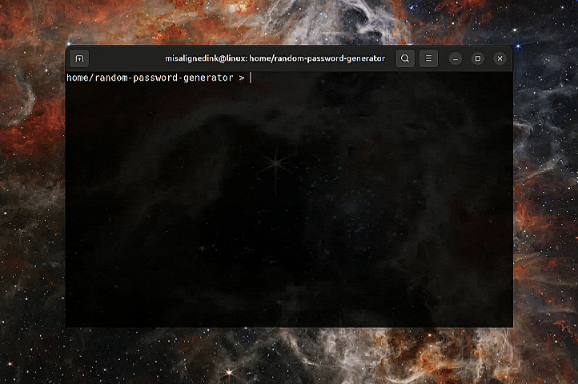

# Random Password Generator

Make sure you've `git` and `python` installed in your computer.

Now, first open your terminal/powershell and clone the repository

```bash
git clone https://github.com/misalignedink/random-password-generator.git
```

Then, change the directory and run the python script using this commands,

```bash
cd random-password-generator
python3 main.py
```

and, secure your digital addresses.

<p align="center">
  
</p>


